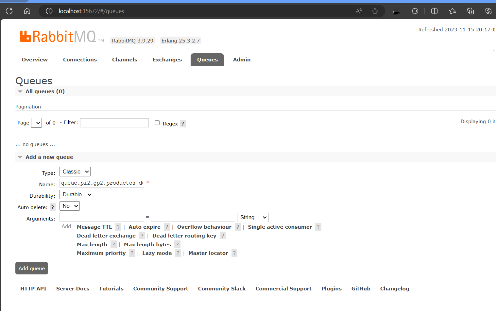

# proyecto-integrador-2

1. config-server
2. discovery
3. gateway
4. Correr: docker run -d --name rabbitmq -p 5672:5672 -p 15672:15672 rabbitmq:3.9-management
5. usuarios
6. donaciones
7. crear cola en rabbitMQ colocar el nombre y presionar Add queue

```
queue.pi2.gp2.productos_donaciones
```



8. productos
